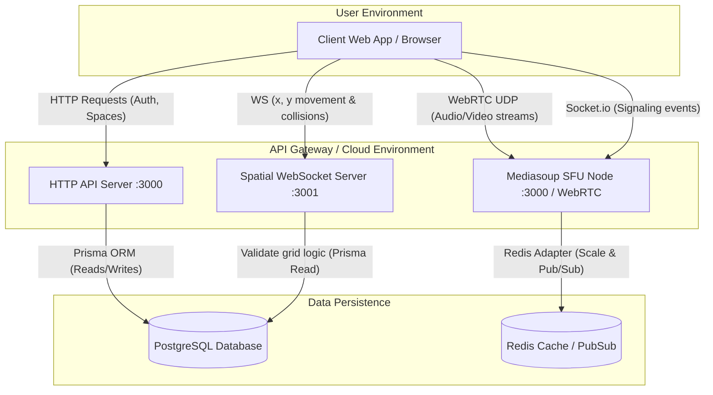

# Metaverse2D / HiveRTC Architecture Report

## Overview

This architecture report details the components of **Metaverse2D (HiveRTC)**, a 2D spatial chat and real-time interaction platform. The codebase relies on a scalable monorepo setup using Turborepo with pnpm workspaces. The platform merges traditional REST API mechanisms for state persistence with low-latency WebSockets for 2D spatial movement, and a WebRTC-based Selective Forwarding Unit (SFU) for scalable audio and video communication.

## Core Components

### 1. Frontend Client (`apps/frontend`)

- **Technology**: React, Vite, TypeScript.
- **Responsibility**: Provides the user interface, maps interactions, 2D avatar rendering, and manages client-side media devices (camera/microphone). It establishes three distinct network connections:
  - HTTP Requests to the REST API for static data and authentication.
  - WebSocket Connection to the WS server for real-time `(x, y)` metadata and coordinate broadcasting.
  - WebRTC Transport to the SFU Backend to transmit and receive video/audio media.

### 2. HTTP REST API Server (`apps/httpserver`)

- **Technology**: Node.js, Express, TypeScript, Zod, JWT.
- **Responsibility**: Manages strictly persistent data and authentication.
  - Handles User Signup, Signin, and rate limits.
  - Space (Arena) management: Creating spaces, getting active spaces.
  - Admin functionalities: Defining new map items, elements, avatars.
  - Interacts directly with the PostgreSQL database.

### 3. Spatial WebSocket Server (`apps/websocket`)

- **Technology**: Node.js, `ws` library.
- **Responsibility**: Real-time positional management and spatial logic.
  - Facilitates real-time movement broadcasts (e.g., `user-joined`, `movement`, `movement-rejected`).
  - Verifies and filters user movements based on map constraints queried dynamically from the database.
  - Avoids sending heavy JSON objects by maintaining minimal state and broadcasting delta `x`, `y` values.

### 4. Media SFU Server (`apps/sfu_comm`)

- **Technology**: Node.js, Express, `Socket.io`, `mediasoup`, `ioredis`.
- **Responsibility**: A Selective Forwarding Unit architecture to efficiently route Media Streams.
  - `WorkerManager`: Initializes Mediasoup workers to handle hardware-level UDP media streams.
  - Allows peers to connect and define WebRTC `Producers` (sending video/audio) and `Consumers` (receiving video/audio).
  - Integrates **Redis** (`@socket.io/redis-adapter` and `ioredis`) to scale the Socket.io instances horizontally if multiple containers are running.

### 5. PostgreSQL Database (`packages/database`)

- **Technology**: PostgreSQL, Prisma Engine.
- **Responsibility**: Single Source of Truth for system domains:
  - Models: `User`, `Space`, `Element`, `spaceElements`, `Map`, `MapElements`, `Avatar`.
  - Used uniformly by both the HTTP server and WS server.

### 6. Shared Packages (`packages/`)

- Shared configurations to maintain monorepo health across workspaces: Typescript configs (`typescript-config`), ESLint rules (`eslint-config`), UI components (`ui`), Redis schemas (`redis`), and Database (`database`).

---

## Architectural Diagram

Below is the system layout rendered using a Mermaid diagram. You can embed this into your major project report.

## Scalability and Future-proofing

- **Separation of Concerns**: Position data (high frequency, small payloads) is strictly detached from media transport (high bandwidth, intensive protocol signaling).
- **Horizontal Scalability built-in**: The SFU implementation already incorporates `@socket.io/redis-adapter`, allowing you to spin up multiple instances of `sfu_comm` across varying docker containers to balance traffic dynamically.
- **Code Portability**: The `apps/webRTC_golang` directory indicates exploration or fallback logic into high-concurrency Go runtimes for the signaling server, maintaining flexibility. All database schemas are centralized locally via `packages/database`, keeping queries decoupled and standardized.

## Future Work

1. **Auto-Scaling Infrastructure for SFU (Duration: 3-4 Weeks)**
   - Transition the media SFU nodes into an auto-scaling cluster (e.g., using Kubernetes HPA). Mediasoup instances are heavy on networking; auto-scaling based on CPU/Bandwidth metrics will ensure robust performance under heavy user loads.

2. **Interactive Metaverse Objects (Duration: 4-5 Weeks)**
   - Enhance the `Element` schema and frontend rendering to support interactive proximity-based tools. For instance, allowing users to collaborate on embedded whiteboards, share screens to displays, or launch mini-games when their avatars step close to a designated spatial element.

3. **End-to-End Encryption (E2EE) for WebRTC Streams (Duration: 2-3 Weeks)**
   - Implement WebRTC Insertable Streams to provide end-to-end encryption for audio and video media packets. This ensures zero-knowledge media routing, bolstering enterprise-level security and privacy constraints.

4. **Spatial 3D Audio Integration (Duration: 2-3 Weeks)**
   - Integrate spatial 3D audio algorithms using Web Audio APIs (like `PannerNode`) on the frontend. By listening to the dynamic `(x, y)` coordinate updates of remote users, their voice volume and stereo panning will realistically change depending on where they are standing relative to the local user.

5. **Comprehensive Admin & Analytics Dashboard (Duration: 3-4 Weeks)**
   - Develop a detailed admin monitoring interface to visualize real-time room occupancies, server resource utilization, and spatial metrics. This will involve integrating with tools like Prometheus and Grafana to track Node.js/Mediasoup telemetry metrics seamlessly.
